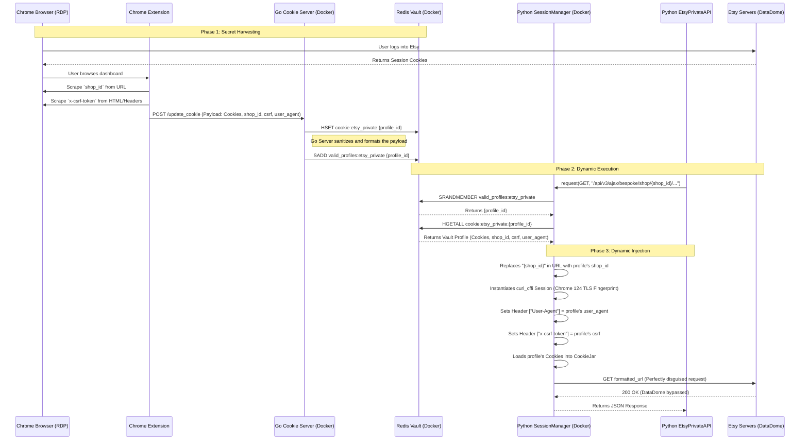

# Etsy Niche Decision Machine - Architecture Visualization

This document provides a visual representation of the updated, deadlock-free architecture, specifically illustrating the flow of authentication data (Cookies, CSRF Tokens, Shop IDs, and User-Agents) from the Chrome Browser all the way to the Etsy API.

## Data Flow Diagram

### Key Architectural Fixes Visualized Here:
1. **No Circular Dependency:** The Python Scraper (`EtsyPrivateAPI`) no longer attempts to scrape the dashboard for `shop_id`. It relies entirely on the Chrome Extension to provide it.
2. **Dynamic URL Formatting:** The URL template contains `{shop_id}`. The `SessionManager` performs a string replacement right before sending the request, matching the exact profile pulled from the database.
3. **Perfect Disguise:** By saving the `user_agent` alongside the cookies in Phase 1, the `SessionManager` in Phase 3 can perfectly mimic the exact browser that generated the cookies, preventing TLS/User-Agent mismatch detection by DataDome.
